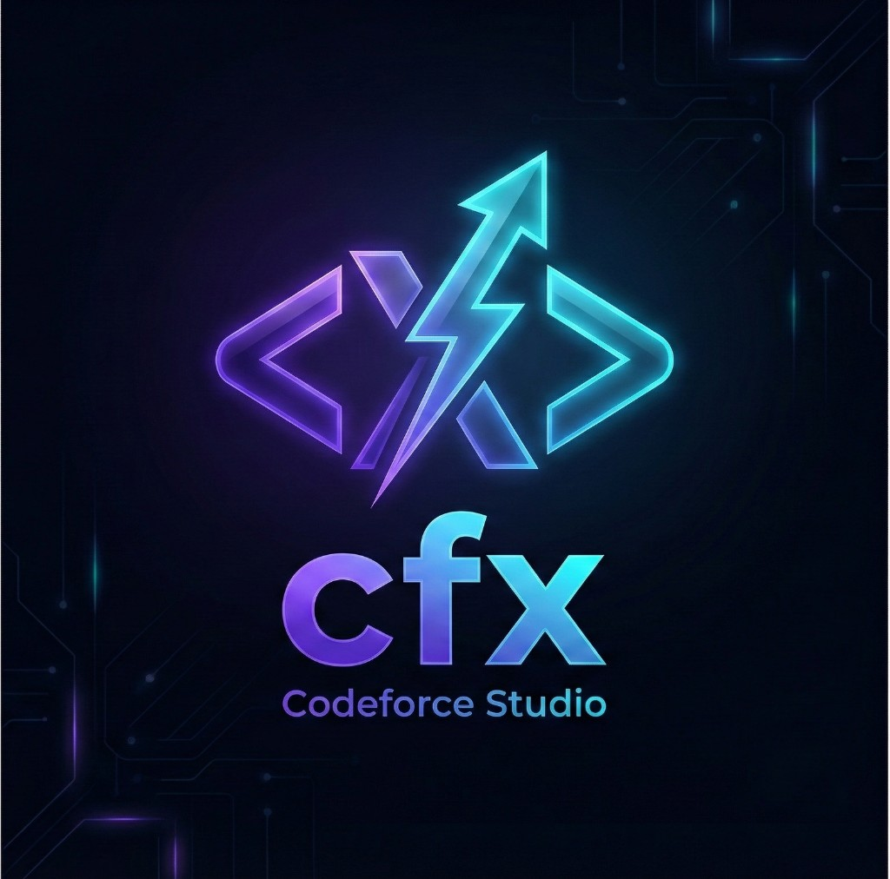

<div align="center">



# CFX - Codeforces Studio

**The Professional Codeforces Contest Workspace for VS Code & Cursor**

[](https://code.visualstudio.com/)
[](https://cursor.sh/)
[](LICENSE)

_Setup contests, test solutions, get AI-powered analysis, and submit with confidence—all from your editor._

</div>

---

## 🚀 Quick Start

### Installation

**Option 1: Install from VSIX** (Recommended)

1. Download the latest `.vsix` file from [Releases](https://github.com/rodriguescarson/codeforces-contest-helper/releases)
2. Open VS Code/Cursor
3. Press `Cmd+Shift+P` (Mac) or `Ctrl+Shift+P` (Windows/Linux)
4. Type: `Extensions: Install from VSIX...`
5. Select the downloaded `.vsix` file

**Option 2: Install from Source**

```bash
cd vscode-extension
npm install
npm run compile
# Then install the .vsix file created in the directory
```

### First-Time Setup

1. **Configure AI (Optional but Recommended)**
   - Get a free API key from [OpenRouter.ai](https://openrouter.ai) (supports GPT-4, Claude, and more)
   - Press `Cmd+Shift+P` → `cfx: Configure API Key`
   - Paste your API key when prompted
   - Or manually: Settings → Search `codeforces.aiApiKey` → Enter key

2. **Setup Your Profile (Optional)**
   - Press `Cmd+Shift+P` → `cfx: Setup Profile`
   - Enter your Codeforces username
   - Or add to `.env` file: `CF_USERNAME=your_handle`

3. **You're Ready!** Start solving contests right away.

---

## ✨ Features

### 🎯 One-Click Contest Setup

Paste any Codeforces problem URL and instantly get:

- ✅ Organized directory structure (`contests/{contestId}/{problem}/`)
- ✅ Test cases automatically fetched
- ✅ C++ template ready to code
- ✅ Input/output files prepared

**How to use:**

1. Press `Cmd+Shift+P` → `cfx: Setup Contest from URL`
2. Paste: `https://codeforces.com/contest/2112/problem/A`
3. Start coding!

### ⚡ Instant Test Runner

Compile and test your solution with one click:

- ✅ Automatic compilation
- ✅ Runs against test cases
- ✅ Shows pass/fail results
- ✅ Displays expected vs actual output

**How to use:**

1. Open `main.cpp` in a contest directory
2. Click the ▶️ **Run Tests** button in the editor toolbar
3. See results instantly

### 🤖 AI-Powered Code Analysis

Get intelligent feedback on your solutions:

- ✅ Code review and bug detection
- ✅ Time/space complexity analysis
- ✅ Optimization suggestions
- ✅ Edge case identification
- ✅ Alternative approaches

**How to use:**

1. Open `main.cpp` in a contest directory
2. Click the ✨ **AI Analysis** button
3. Get instant feedback in the chat sidebar

### 💬 Interactive Chat Assistant

Chat with AI about your code:

- ✅ Context-aware conversations
- ✅ Code insertion (replace/insert/selection)
- ✅ Multiple chat sessions
- ✅ Code analysis on demand

**How to use:**

1. Click the 💬 **Open Chat** button
2. Ask questions about your code
3. Get help with debugging and optimization

### 📊 Contest & Profile Dashboard

Stay organized and track your progress:

- ✅ Upcoming contests list
- ✅ Profile stats with avatar
- ✅ Rating history
- ✅ Recent submissions

**How to use:**

- Open the **CFX Studio** sidebar (left panel)
- View contests, profile, and chat sessions

### 📋 Quick Actions

- **Copy Code**: One-click copy to clipboard for submission
- **Setup from Contest**: Browse and setup from upcoming contests
- **Refresh Data**: Update contests and profile info

---

## 📖 Detailed Usage Guide

### Setting Up a Contest Problem

**Method 1: From URL**

```
Cmd+Shift+P → "cfx: Setup Contest from URL"
→ Paste: https://codeforces.com/contest/2112/problem/A
```

**Method 2: From Contest List**

1. Open CFX Studio sidebar
2. Click on any contest in "Upcoming Contests"
3. Select a problem to setup

### Running Tests

1. **Open** `contests/{contestId}/{problem}/main.cpp`
2. **Click** the ▶️ button in editor toolbar
3. **View** results in Output channel

**What happens:**

- Code compiles with `g++`
- Runs with `in.txt` as input
- Compares output with `out.txt`
- Shows detailed pass/fail results

### Using AI Analysis

**Prerequisites:** Configure API key first (see Quick Start)

**Method 1: Quick Analysis**

- Click ✨ **AI Analysis** button
- Get instant review in output channel

**Method 2: Chat Interface**

- Click 💬 **Open Chat** button
- Ask specific questions
- Get interactive help

### Copying Code for Submission

1. Open `main.cpp`
2. Click 📋 **Copy Code** button
3. Paste directly into Codeforces submission form

---

## ⚙️ Configuration

### Settings

Open Settings (`Cmd+,` or `Ctrl+,`) and search for "codeforces":

| Setting                   | Description                                                 | Default                       |
| ------------------------- | ----------------------------------------------------------- | ----------------------------- |
| `codeforces.contestsPath` | Path to contests directory                                  | `${workspaceFolder}/contests` |
| `codeforces.aiProvider`   | AI provider (`openrouter`, `openai`, `anthropic`, `custom`) | `openrouter`                  |
| `codeforces.aiApiKey`     | Your API key for AI features                                | (empty)                       |
| `codeforces.aiModel`      | Model to use (e.g., `openai/gpt-4`)                         | `openai/gpt-4`                |
| `codeforces.aiBaseUrl`    | Custom API base URL (for custom providers)                  | (empty)                       |

### Environment Variables (Optional)

Create `.env` file in workspace root:

```env
# Codeforces API (optional - for authenticated access)
KEY=your_codeforces_api_key
SECRET=your_codeforces_api_secret
CF_USERNAME=your_handle

# Contest Filters (optional)
CONTEST_FILTER=div2,div3
REMINDER_TIMES=15,30,60
INCLUDE_GYM=false
```

**Get Codeforces API credentials:** https://codeforces.com/settings/api

---

## 🎨 UI Overview

### Sidebar Panels

**CFX Studio** sidebar contains:

- 📅 **Upcoming Contests** - Browse and setup contests
- 👤 **Profile** - View stats, rating, submissions
- 💬 **Chats** - Manage AI chat sessions

### Editor Toolbar Buttons

When editing `main.cpp` in a contest directory:

- ▶️ **Run Tests** - Compile and test
- ✨ **AI Analysis** - Get code review
- 💬 **Open Chat** - Start AI conversation
- 📋 **Copy Code** - Copy to clipboard

### Commands

Access via Command Palette (`Cmd+Shift+P`):

- `cfx: Setup Contest from URL`
- `cfx: Run Tests`
- `cfx: Open Chat`
- `cfx: Configure API Key`
- `cfx: Setup Profile`
- `cfx: Refresh Contests`
- `cfx: Refresh Profile`

---

## 🔧 Requirements

### Required

- **VS Code** 1.80+ or **Cursor** (any version)
- **C++ Compiler** (`g++` recommended)

### Optional

- **AI API Key** - For AI features (get from [OpenRouter.ai](https://openrouter.ai))
- **Codeforces Account** - For profile features
- **`cf` CLI Tool** - Alternative test case fetcher (install separately)

---

## 🆘 Troubleshooting

### Extension Not Working

- **Check VS Code version**: Requires 1.80+
- **Reload window**: `Cmd+Shift+P` → "Developer: Reload Window"
- **Check Output**: View → Output → Select "cfx - codeforce studio"

### Tests Not Running

- **Verify compiler**: Run `g++ --version` in terminal
- **Check file location**: Must be in `contests/{contestId}/{problem}/main.cpp`
- **Check test files**: Ensure `in.txt` and `out.txt` exist

### AI Features Not Working

- **Check API key**: Settings → `codeforces.aiApiKey`
- **Verify key is valid**: Test at [OpenRouter.ai](https://openrouter.ai)
- **Check account balance**: Ensure API account has credits
- **View errors**: Check Output channel for details

### Profile Not Loading

- **Verify username**: Check `.env` file or settings
- **Check internet**: Ensure Codeforces API is accessible
- **Try refresh**: Use `cfx: Refresh Profile` command

### Need More Help?

- 📖 See [TROUBLESHOOTING.md](TROUBLESHOOTING.md) for detailed solutions
- 🐛 [Report Issues](https://github.com/rodriguescarson/codeforces-contest-helper/issues)
- 💬 Check [API_SUMMARY.md](API_SUMMARY.md) for API setup help

---

## 🎯 Use Cases

### Competitive Programming Practice

- Setup problems instantly
- Test solutions locally
- Get AI feedback before submitting
- Track progress with profile stats

### Contest Preparation

- Browse upcoming contests
- Setup problems in advance
- Practice with test cases
- Review solutions with AI

### Learning & Improvement

- Understand code complexity
- Learn optimization techniques
- Get alternative approaches
- Review edge cases

---

## 🔐 Privacy & Security

- ✅ **No Data Collection**: Extension doesn't collect or store user data
- ✅ **Local Storage**: All data stays on your machine
- ✅ **Encrypted Keys**: API keys stored securely in VS Code settings
- ✅ **HTTPS Only**: All API calls use secure connections
- ✅ **BYOK Model**: You provide your own API keys

---

## 📚 Additional Resources

- 📖 [OpenRouter Setup Guide](OPENROUTER_SETUP.md) - Detailed AI setup
- 🔌 [API Summary](API_SUMMARY.md) - All APIs explained
- 🚀 [Production Deployment](PRODUCTION_DEPLOYMENT.md) - For developers
- 🐛 [Troubleshooting Guide](TROUBLESHOOTING.md) - Common issues

---

## 🤝 Contributing

Contributions welcome! See our [GitHub](https://github.com/rodriguescarson/codeforces-contest-helper) for:

- Bug reports
- Feature requests
- Pull requests
- Documentation improvements

---

## 📄 License

MIT License - See [LICENSE](LICENSE) file for details.

---

## 🙏 Acknowledgments

- Built for the competitive programming community
- Powered by Codeforces API
- AI features via OpenRouter, OpenAI, and Anthropic

---

<div align="center">

**Made with ❤️ for competitive programmers**

[⭐ Star on GitHub](https://github.com/rodriguescarson/codeforces-contest-helper) • [📝 Report Issue](https://github.com/rodriguescarson/codeforces-contest-helper/issues) • [📖 Documentation](https://github.com/rodriguescarson/codeforces-contest-helper#readme)

</div>

Your extension is published.
Listing (after it’s indexed): https://marketplace.visualstudio.com/items?itemName=rodriguescarson.cf-studio
Manage / future versions: https://marketplace.visualstudio.com/manage/publishers/rodriguescarson/extensions/cf-studio/hub
